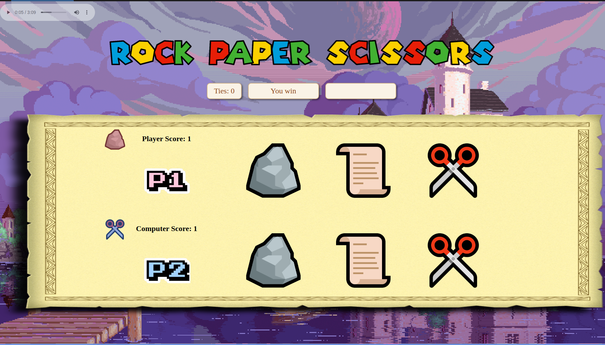

# RPS
Rock Paper Scissors

This is my first JavaScript project for The Odin Project course.
I'm also using HTML and CSS for the game's UI. Some of its functions are:

- 3-second timer after each selection.
- "Play Again?" option upon the game ending.
- Soundtrack composed by Yasunori MItsuda for Chrono Trigger, a 1995 SNES video game.
- Audiovisual hover effects.

<h2>Screenshot</h2>

